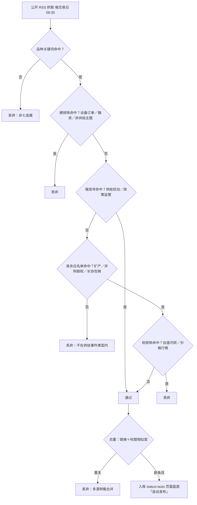

# 自动更新说明（库存与显性供给 + 供给事件池）

> 目标：**网页打开即显示最新数据**，无需你反复上传整页，也不需要人工逐条确认事件。

## 一、两条自动化线路

```
GitHub Actions（每交易日 08:30 北京时间；也可手动 Run workflow）
        ├─ scripts/fetch_stocks.py  →  data/stocks.json   （交易所库存，数字）
        └─ scripts/fetch_events.py  →  data/events.json   （供给事件池，标题级）
                        ↓  自动 commit
                   Pages 自动重建
                        ↓
   你打开页面 → 同源读取 data/*.json → 库存卡片刷新、事件卡片并入自动发布条目
```

- 两条都带**失败兜底**：任一步失败或本地打开文件，页面自动回退到内置基线，其余功能不受影响。
- 页面顶部的库存卡显示「**数据时点**」；事件卡片里自动抓取的条目标为**蓝底 + 「自动发布」**。

## 二、覆盖范围

### 1. 库存与显性供给（数字）

**A. 自动刷新（交易所口径）**

| 交易所 | 品种 | 单位 | 来源（公开） |
|--------|------|------|--------------|
| LME | Cu / Al / Zn / Pb / Ni / Sn | kt（原表 t÷1000） | westmetall 公开镜像表（LME 官网对本类请求返回 403） |
| SHFE | Cu / Al / Zn / Pb / Ni / Sn | kt（仓单合计 t÷1000） | 上期所官网「每日仓单」公布页 |

**B. 核验基线（已核定数值，暂不自动抓取）**

| 交易所 | 品种 | 单位 | 来源（公开） | 现状下为何不自动 |
|--------|------|------|--------------|------------------|
| GFEX 广期所 | 碳酸锂 | kt（1 吨/手，手数即吨数） | 广期所仓单日报（按品种统计） | 官网对自动化请求返回 JS 挑战页（WAF） |
| DCE 大商所 | 铁矿石 | kt（1 手 = 100 吨） | 大商所仓单日报（按品种统计） | 官网对非浏览器请求返回 HTTP 412 |

> **为什么锂、铁不在 LME / SHFE**：LME 的实物金属只有铜、铝、铅、锌、镍、锡六个品种；其锂合约（氢氧化锂，2021 年 7 月上市）为**现金交割**，不交割实物、因而不产生仓库库存。上期所也没有锂与铁矿石。碳酸锂期货在**广期所**、铁矿石期货在**大商所**，两者均为实物交割，故有注册仓单——页面已按此补上这两个来源。
>
> **为什么同时保留行业调查口径**：对锂、铁而言交易所仓单并非定价主锚。铁矿石仓单约 515 kt，同期 47 港港口库存约 171,360 kt，仓单占比仅约 **0.3%**；碳酸锂仓单约 34 kt，对 SMM 修订口径社库约 164 kt。故两类口径**并排展示、逐卡标注、不做合并**。
>
> **口径标签**：卡片右上角两颗标签中，绿色「**交易所**」= 交易所注册仓单/库存；琥珀色「**行业调查**」= SMM / Mysteel / ICA 等样本调查或产量口径，两者**不可直接相加**。

### 2. 供给事件池（标题级，日频）

| 来源 | 说明 |
|------|------|
| mining-technology.com、northernminer.com、australianmining.com.au、im-mining.com | RSS，稳定 |
| mining.com | RSS，偶发被 CDN 拦截，失败自动跳过 |

抓取流程是**两层漏斗**，只有同时通过两层才会入库：

**第一层 · 品种归类**
标题 + 摘要按品种关键词自动归入 Cu / Al / PbZn / Ni / Sn / Li / Fe；未命中任何品种的条目直接丢弃。

**第二层 · 事件类型白名单**（关键变更）
在品种之外再加一道类型判断——只有真正改变金属供给的事件才入库：

| 白名单（命中即入库） | 判定示例 |
|---|---|
| 供给扰动 | 停产、事故、罢工、不可抗力、减产、复产 |
| 扩产 | 投产、扩产、爬坡、达产、新增选厂 |
| 并购/股权 | 收购、出售、控制权变更、股权转让 |
| 长协/包销 | 承购协议、供货协议、多年期协议 |
| 政策/监管 | 出口禁令或配额、关税、矿业法、国有化、许可吊销 |

| 黑名单（命中即丢弃） | 典型内容 |
|---|---|
| 估值/可研 | PEA / PFS / 可研、资源量更新、钻探结果、成本与资本开支 |
| 融资类 | 配售、定增、募资、贷款安排、上市 |
| 设备/服务订单 | 采购订单、分析仪、雷达、机车、装备与系统、服务合同 |
| 价格/行情 | 价格涨跌、创新高、行情与库存点评 |
| 非供给主题 | 碳排放与 ESG、人事任免、分红、会议、评奖 |

> **两条冲突规则**（决定一条稿子到底收不收）：
> 1. **硬排除一票否决**——设备/服务订单、融资、非供给主题这三类只要命中，一律丢弃（避免「设备服务合同里出现 agreement 被当成包销」）。
> 2. **强信号覆盖**——停产/事故类与政策监管类事件，即便稿子里同时出现「成本」「价格」这类软性排除词，也仍然保留，避免真正的减产被成本数据误杀。
>
> 其余情况：命中软排除（估值/可研、价格/行情）即丢弃；未命中任何白名单即丢弃。



*图：供给事件两层过滤漏斗——品种归类在前，事件类型过滤在后，硬排除一票否决，强信号可覆盖软排除。*

### 3. 其他机制

- **去重**：先按链接去重，再按标题标准化 + 词元相似度（≥0.7）合并同一新闻的多源转载。
- **状态**：通过两层漏斗的新条目 `status: auto`、`src_level: media`，页面显示**蓝底 + 「自动发布」**，**无需人工确认**；已回溯一手来源或人工核定的条目为 `status: ok`（页面「已核验」）。
- **不改动存量**：自动抓取**永远不改动已核过的 49 条存量事件**，只向上追加。

**合规红线**：只抓公开页面与公开 RSS；**不抓取任何会员制 / 付费内容（如 SMM / Mysteel 会员区）**。

## 三、首次启用（一次性）

1. 仓库根目录应有：
   ```
   index.html
   data/stocks.json
   data/events.json
   scripts/fetch_stocks.py
   scripts/fetch_events.py
   .github/workflows/update-stocks.yml
   ```
2. **Settings → Actions → General → Workflow permissions** → 选 **Read and write permissions** → Save
   （否则工作流无法把 `data/*.json` 提交回来）
3. **Actions** → 左侧选 `Update stocks & supply events` → **Run workflow** 手动跑一次确认成功。
4. **Settings → Pages** → Source 选 **Deploy from a branch** → 分支 `main`、目录 **`/ (root)`** → Save。
5. 若之后还需要**改工作流文件本身**（`.github/workflows/`），令牌要额外勾 **Workflows: Read and write**；只改页面 / 脚本 / 数据则不需要。

## 四、日常

- **什么都不用做**：工作日早晨自动更新库存与事件池并上线；事件池已按类型白名单自动过滤，**不需要你再逐条确认**。
- 想立刻刷新：Actions 页面点 **Run workflow**；或本地执行：
  ```
  python3 scripts/fetch_stocks.py --out data/stocks.json
  python3 scripts/fetch_events.py  --out data/events.json
  ```
- 想改抓取范围 / 关键词：改 `scripts/fetch_events.py` 里的 `FEEDS` / `STRONG` / `INCLUDE` / `EXCLUDE`，提交即可。
- 想复核规则效果（不写文件，只打印保留与剔除清单）：
  ```
  python3 scripts/fetch_events.py --audit data/events.json
  ```
- 改完关键词**务必先跑回归测试**（20 条已知用例，含 3 条曾经踩过的误杀）：
  ```
  python3 scripts/test_screen.py
  ```
- 想让某条自动条目升级为「已核验」：在 `data/events.json` 中把该条 `status` 改为 `ok`、`src_level` 改为 `primary`，并补 `detail` 口径。

## 五、频率能做到什么程度

| 目标 | 结论 |
|------|------|
| 库存：日频（LME / SHFE） | ✅ 已实现，贴着交易所发布节奏上限 |
| 库存：日频（GFEX / DCE） | ⚠️ 交易所官网反爬（JS 挑战 / HTTP 412），当前为核验基线，需手工或半自动更新 |
| 事件：日频 | ✅ 已实现（与库存同一班次 08:30） |
| 事件：每 15–30 分钟 | ⚠️ 技术上可加（改 cron），但噪音明显上升，建议先按日频观察 |
| 事件：秒级实时 | ❌ 公开来源没有该粒度的供给事件流，需付费新闻源 |

## 六、常见问题

| 现象 | 原因 / 处理 |
|------|-------------|
| 库存数字没变 | 当天为非交易日，或交易所尚未公布；看「数据时点」是否推进 |
| 卡片上「交易所 / 行业调查」两个标签怎么看 | 来源口径：**交易所**=交易所注册仓单/库存；**行业调查**=SMM / Mysteel / ICA 等样本调查或产量。两类不可直接相加，也不可跨口径比较绝对值 |
| 锂、铁卡片日期比其他品种旧 | 属核验基线，不随 `as_of` 推进；各自卡片内标注自己的数据日期 |
| 页面显示「内置基线」 | JSON 未加载成功：确认 `data/*.json` 在仓库根下；强刷页面 |
| 事件卡片没有新的自动发布条目 | 当日无新事件，或新条目全部未通过品种 / 类型两层漏斗；可看工作流日志里的剔除统计 |
| 有该收的供给事件被丢掉了 | 类型白名单太严：调整 `scripts/fetch_events.py` 的 `EXCLUDE`（优先）或 `INCLUDE` 关键词，改完跑 `scripts/test_screen.py` 确认无回退 |
| 收了不该收的（设备订单 / 价格点评） | 黑名单漏词：往 `EXCLUDE` 对应分类里补关键词 |
| 误判某条属于某品种 | 调整 `scripts/fetch_events.py` 的 `STRONG` 关键词 |
| Actions 报 permission denied | 第三节第 2 步的写权限没开 |
| 推送报 `without workflow scope` | 改动 `.github/workflows/` 下的文件时，令牌必须额外有 **Workflows: Read and write** 权限；`Contents` 权限不覆盖工作流文件 |
| 想手动验证工作流 | Actions 页选 `Update stocks & supply events` → **Run workflow**；若想用令牌调 API 触发，还需 **Actions: Read and write** 权限 |
| SHFE 无当日数据 | 仓单通常盘后发布；脚本会自动向前回退最多 10 天找最新公布日 |

## 七、时点口径说明

- 库存 `as_of` = 数据所属交易日（LME 与 SHFE 取两者较新者）；两者公布时间不同，可能来自不同交易日，卡片内各自标注，**不合并为同一时点**。
- GFEX / DCE 等**核验基线**不随 `as_of` 推进，各自卡片内标注自己的数据日期；标题栏「其余为核验基线，时点与口径见各卡」即指此。
- 卡片单位不统一（kt / Mt / kt·月⁻¹），按各卡原生单位展示、不做强行换算；标题栏标注「单位见各卡」。
- 事件卡片统一按**事件时点倒序**（年度/财年取期末，区间取末段，`××起` 取起始日）。
- 自动抓取条目的时点取 **RSS 发布时间**；无发布时间的按抓取当日计，显示为「自动发布」。
- 自动发布条目的**证据层级是公开媒体**，不是公司公告或交易所披露；口径字段中凡媒体未披露的数量与单位，一律写明「未披露」，不推测填数。

## 八、地图圆点编码口径

地图圆点默认**按实物产量缩放**，但这一列数据的口径复杂，因此先拆口径再绘图：

**为什么要先拆口径**：榜单里那个「产量」数字存在两类口径陷阱——

1. **倍率不一**：`unit` 文本里既有 `Mt` 也有 `kt`。铝（Al）一列就混着 25 个 `Mt` 与 10 个 `kt`；若直接比数字，几内亚铝土 150（Mt）会看起来只有中国原铝 45,020（kt）的 1/300，实际前者反而更大。脚本统一换算到 kt 后再缩放。
2. **基别不一**：`kt LCE` / `kt SC6` / `kt LiOH` / `kt 锌精矿` / `Mt 矿石` 等是不同物质，1 吨锂精矿与 1 吨碳酸锂当量**不可互换**。图中只按各自**实物吨位**缩放，并在图例列出本品种出现的全部基别。

**缩放规则**：

| 类别 | 判定 | 渲染 |
|---|---|---|
| 单点资产·产量 | `type ∈ {mine, brine, hardrock, lepidolite, bauxite, refinery, smelter, project}` 且为产量类、吨位 > 0 | 实心圆，**面积按吨位线性映射**（含最小可见直径修正） |
| 汇总项 | `type ∈ {country, company, benchmark, hub, ...}` | 等大空心圆，不缩放 |
| 非产量项 | `unit` 含 库存 / 平衡 / 过剩 / 产能(pa) / 月度 | 等大空心圆，不缩放 |
| 无吨位 | 吨位为 0 或口径未标 | 等大空心圆，不缩放 |

**开关**：地图标题栏右侧「圆点：按产量 / 统一」可实时切换回等大圆点，便于对照。

**已知局限**（写在图例里）：同一张图内不同基别的吨位不可折算为含金属量等级。例如锂图上 Greenbushes（SC 精矿 1,350 kt）的圆比 Salar de Atacama（LCE 235 kt）大，这是实物吨位事实，但**不等于**其含锂量是后者的 5.7 倍。

> 另：原先页脚的「产量示意合计」已**移除**——它把不同倍率与不同基别的数字直接相加（铝图里等于把 150 Mt 当 150 加上去），属错误口径，改为「按产量缩放 N 点」。

## 九、研究数据基线日（DATA_BASELINE）

页面顶部与侧栏会显示一个「**研究数据基线 2026-09-24**」标识，它回答的是：**这份快照是哪天的**。

| 数据 | 是否自动 | 时点标识 |
|---|---|---|
| 榜单（RANK）/ 产量追踪（TRACK）/ 来源总表（SOURCES）/ 事件存量 | ❌ 人工核验快照 | **研究数据基线日** |
| LME·SHFE 库存（`data/stocks.json`） | ✅ 每交易日自动 | 库存卡内的「数据时点」 |
| 供给事件新条目（`data/events.json`） | ✅ 每交易日自动 | 卡片「自动发布」+ RSS 发布日期 |
| GFEX·DCE 交易所仓单 | ❌ 核验基线 | 各卡自带日期 |

**维护方式**：基线日定义在 `index.html` 里的一行常量——

```js
const DATA_BASELINE = '2026-09-24';
```

**每次改动研究内容（新增点、修订吨位、更换来源、增删事件）后，必须把这个日期改成当天**，否则页面会显示一个偏旧的基线日。这是目前唯一需要人工维护的时点字段。

> 为何不自动推导：基线日不是数据里的最大日期（那不是「核验日」），而是「最后一次逐条核对的日期」——这是个人工事实，无法从数据自身算出。
