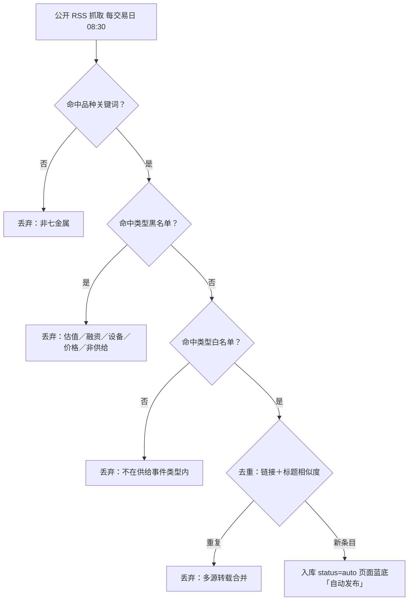

# 自动更新说明（交易所库存 + 供给事件池）

> 目标：**网页打开即显示最新数据**，无需你反复上传整页，也不需要人工逐条确认事件。

## 一、两条自动化线路

```
GitHub Actions（每交易日 08:30 北京时间；也可手动 Run workflow）
        ├─ scripts/fetch_stocks.py  →  data/stocks.json   （交易所库存，数字）
        └─ scripts/fetch_events.py  →  data/events.json   （供给事件池，标题级）
                        ↓  自动 commit
                   Pages 自动重建
                        ↓
   你打开页面 → 同源读取 data/*.json → 库存卡片刷新、事件卡片并入自动发布条目
```

- 两条都带**失败兜底**：任一步失败或本地打开文件，页面自动回退到内置基线，其余功能不受影响。
- 页面顶部的库存卡显示「**数据时点**」；事件卡片里自动抓取的条目标为**蓝底 + 「自动发布」**。

## 二、覆盖范围

### 1. 交易所库存（数字，日频）

| 交易所 | 品种 | 单位 | 来源（公开） |
|--------|------|------|--------------|
| LME | Cu / Al / Zn / Pb / Ni / Sn | kt（原表 t÷1000） | westmetall 公开镜像表（LME 官网对本类请求返回 403） |
| SHFE | Cu / Al / Zn / Pb / Ni / Sn | kt（仓单合计 t÷1000） | 上期所官网「每日仓单」公布页 |

### 2. 供给事件池（标题级，日频）

| 来源 | 说明 |
|------|------|
| mining-technology.com、northernminer.com、australianmining.com.au、im-mining.com | RSS，稳定 |
| mining.com | RSS，偶发被 CDN 拦截，失败自动跳过 |

抓取流程是**两层漏斗**，只有同时通过两层才会入库：

**第一层 · 品种归类**
标题 + 摘要按品种关键词自动归入 Cu / Al / PbZn / Ni / Sn / Li / Fe；未命中任何品种的条目直接丢弃。

**第二层 · 事件类型白名单**（关键变更）
在品种之外再加一道类型判断——只有真正改变金属供给的事件才入库：

| 白名单（命中即入库） | 判定示例 |
|---|---|
| 供给扰动 | 停产、事故、罢工、不可抗力、减产、复产 |
| 扩产 | 投产、扩产、爬坡、达产、新增选厂 |
| 并购/股权 | 收购、出售、控制权变更、股权转让 |
| 长协/包销 | 承购协议、供货协议、多年期协议 |
| 政策/监管 | 出口禁令或配额、关税、矿业法、国有化、许可吊销 |

| 黑名单（命中即丢弃） | 典型内容 |
|---|---|
| 估值/可研 | PEA / PFS / 可研、资源量更新、钻探结果、成本与资本开支 |
| 融资类 | 配售、定增、募资、贷款安排、上市 |
| 设备/服务订单 | 采购订单、分析仪、雷达、机车、装备与系统、服务合同 |
| 价格/行情 | 价格涨跌、创新高、行情与库存点评 |
| 非供给主题 | 碳排放与 ESG、人事任免、分红、会议、评奖 |

> **黑名单优先**：只要命中黑名单，无论是否命中白名单一律丢弃。这样可避免「设备服务合同里出现了 agreement 被当成包销」这类误收。



*图：供给事件两层过滤漏斗——品种归类在前，事件类型白名单在后，黑名单一票否决。*

### 3. 其他机制

- **去重**：先按链接去重，再按标题标准化 + 词元相似度（≥0.7）合并同一新闻的多源转载。
- **状态**：通过两层漏斗的新条目 `status: auto`、`src_level: media`，页面显示**蓝底 + 「自动发布」**，**无需人工确认**；已回溯一手来源或人工核定的条目为 `status: ok`（页面「已核验」）。
- **不改动存量**：自动抓取**永远不改动已核过的 49 条存量事件**，只向上追加。

**合规红线**：只抓公开页面与公开 RSS；**不抓取任何会员制 / 付费内容（如 SMM / Mysteel 会员区）**。

## 三、首次启用（一次性）

1. 仓库根目录应有：
   ```
   index.html
   data/stocks.json
   data/events.json
   scripts/fetch_stocks.py
   scripts/fetch_events.py
   .github/workflows/update-stocks.yml
   ```
2. **Settings → Actions → General → Workflow permissions** → 选 **Read and write permissions** → Save
   （否则工作流无法把 `data/*.json` 提交回来）
3. **Actions** → 左侧选 `Update stocks & supply events` → **Run workflow** 手动跑一次确认成功。
4. **Settings → Pages** → Source 选 **Deploy from a branch** → 分支 `main`、目录 **`/ (root)`** → Save。
5. 若之后还需要**改工作流文件本身**（`.github/workflows/`），令牌要额外勾 **Workflows: Read and write**；只改页面 / 脚本 / 数据则不需要。

## 四、日常

- **什么都不用做**：工作日早晨自动更新库存与事件池并上线；事件池已按类型白名单自动过滤，**不需要你再逐条确认**。
- 想立刻刷新：Actions 页面点 **Run workflow**；或本地执行：
  ```
  python3 scripts/fetch_stocks.py --out data/stocks.json
  python3 scripts/fetch_events.py  --out data/events.json
  ```
- 想改抓取范围 / 关键词：改 `scripts/fetch_events.py` 里的 `FEEDS` / `STRONG` / `INCLUDE` / `EXCLUDE`，提交即可。
- 想复核规则效果（不写文件，只打印保留与剔除清单）：
  ```
  python3 scripts/fetch_events.py --audit data/events.json
  ```
- 想让某条自动条目升级为「已核验」：在 `data/events.json` 中把该条 `status` 改为 `ok`、`src_level` 改为 `primary`，并补 `detail` 口径。

## 五、频率能做到什么程度

| 目标 | 结论 |
|------|------|
| 库存：日频 | ✅ 已实现，贴着交易所发布节奏上限 |
| 事件：日频 | ✅ 已实现（与库存同一班次 08:30） |
| 事件：每 15–30 分钟 | ⚠️ 技术上可加（改 cron），但噪音明显上升，建议先按日频观察 |
| 事件：秒级实时 | ❌ 公开来源没有该粒度的供给事件流，需付费新闻源 |

## 六、常见问题

| 现象 | 原因 / 处理 |
|------|-------------|
| 库存数字没变 | 当天为非交易日，或交易所尚未公布；看「数据时点」是否推进 |
| 页面显示「内置基线」 | JSON 未加载成功：确认 `data/*.json` 在仓库根下；强刷页面 |
| 事件卡片没有新的自动发布条目 | 当日无新事件，或新条目全部未通过品种 / 类型两层漏斗；可看工作流日志里的剔除统计 |
| 有该收的供给事件被丢掉了 | 类型白名单太严：调整 `scripts/fetch_events.py` 的 `EXCLUDE`（优先）或 `INCLUDE` 关键词 |
| 收了不该收的（设备订单 / 价格点评） | 黑名单漏词：往 `EXCLUDE` 对应分类里补关键词 |
| 误判某条属于某品种 | 调整 `scripts/fetch_events.py` 的 `STRONG` 关键词 |
| Actions 报 permission denied | 第三节第 2 步的写权限没开 |
| 推送报 `without workflow scope` | 改动 `.github/workflows/` 下的文件时，令牌必须额外有 **Workflows: Read and write** 权限；`Contents` 权限不覆盖工作流文件 |
| 想手动验证工作流 | Actions 页选 `Update stocks & supply events` → **Run workflow**；若想用令牌调 API 触发，还需 **Actions: Read and write** 权限 |
| SHFE 无当日数据 | 仓单通常盘后发布；脚本会自动向前回退最多 10 天找最新公布日 |

## 七、时点口径说明

- 库存 `as_of` = 数据所属交易日（LME 与 SHFE 取两者较新者）；两者公布时间不同，可能来自不同交易日，卡片内各自标注，**不合并为同一时点**。
- 事件卡片统一按**事件时点倒序**（年度/财年取期末，区间取末段，`××起` 取起始日）。
- 自动抓取条目的时点取 **RSS 发布时间**；无发布时间的按抓取当日计，显示为「自动发布」。
- 自动发布条目的**证据层级是公开媒体**，不是公司公告或交易所披露；口径字段中凡媒体未披露的数量与单位，一律写明「未披露」，不推测填数。
